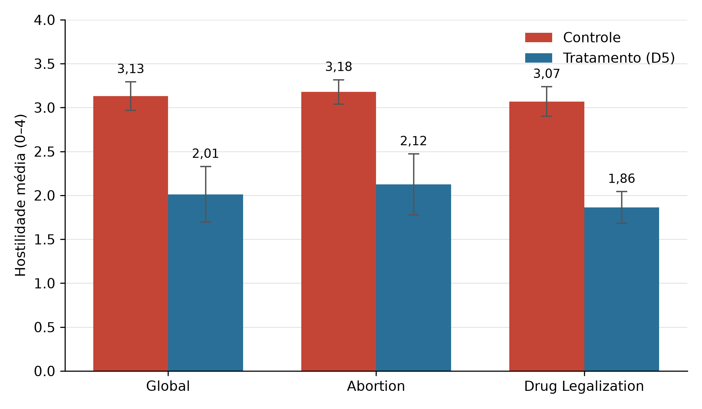
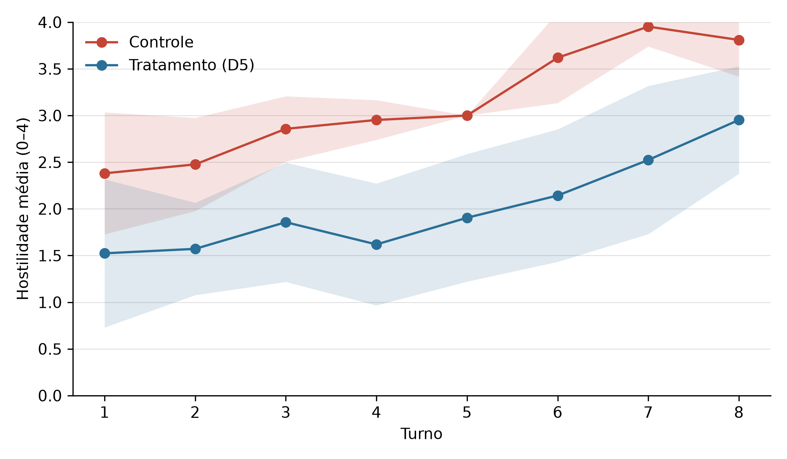
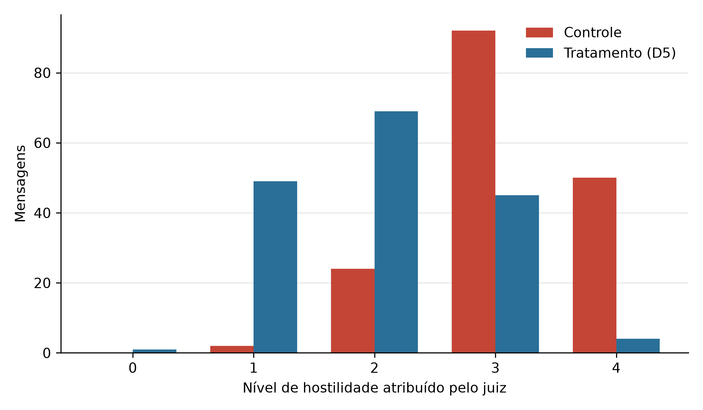
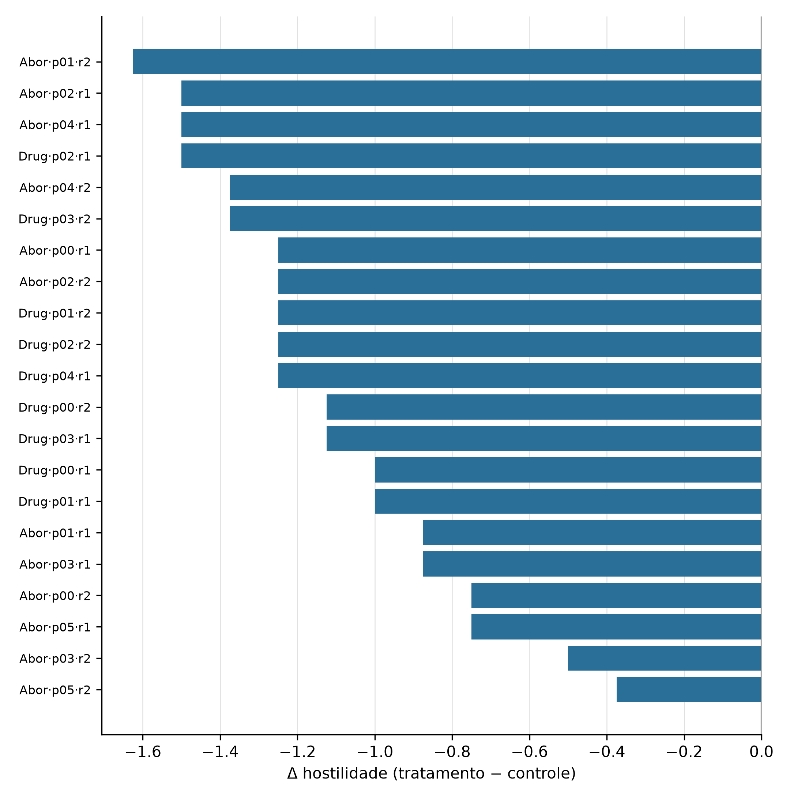

# Resultados preliminares — Moderação participativa (D5)

## Corpus

- Desenho: completo
- Temas: Abortion, Drug Legalization
- Células (tema × par de personas): 11
- Réplicas: 21
- Debates: 42 (8 turnos cada)
- Execuções descartadas na seleção: 18

## Resultado principal

A moderação participativa reduziu a hostilidade média de **3,13** para **2,01** na escala 0–4 (Δ = **-1,12**), com efeito na mesma direção em 21 das 21 células.

## Tabelas

| Recorte | Células | Controle | Tratamento | Δ | DP(Δ) | Células com Δ<0 |
|---|---:|---:|---:|---:|---:|---:|
| Global | 21 | 3,13 | 2,01 | -1,12 | 0,33 | 21/21 |
| Abortion | 12 | 3,18 | 2,12 | -1,05 | 0,40 | 12/12 |
| Drug Legalization | 9 | 3,07 | 1,86 | -1,21 | 0,16 | 9/9 |

**Tabela 1 — Efeito principal do D5 sobre a hostilidade.** Hostilidade média por debate (escala 0–4, mediana de três execuções do juiz), agregada por célula (tema × par de personas). Δ é a diferença pareada tratamento − controle dentro de cada célula; valores negativos indicam redução de hostilidade sob moderação. DP(Δ) é o desvio-padrão populacional entre células.

| Métrica | Valor |
|---|---:|
| Turnos de tratamento | 168 |
| Mensagens avaliadas pelo moderador | 166 (99%) |
| Mensagens reformuladas | 153 (91%) |
| Reformuladas / avaliadas | 92% |
| Decisões fora do limiar | 0 (0%) |

**Tabela 2 — Acionamento da moderação participativa (D5).** Toda mensagem candidata na condição de tratamento passa pelo moderador; "reformuladas" são aquelas em que ele substituiu o texto antes da publicação. "Decisões fora do limiar" conta turnos em que a decisão de intervir discordou da própria pontuação atribuída pelo moderador (limiar: hostilidade ≥ 2), medindo sua calibragem interna.

| Métrica | Valor |
|---|---:|
| Mensagens pontuadas | 336 |
| Execuções por mensagem | 3 |
| Unanimidade entre execuções | 334 (99%) |
| Amplitude 0 entre execuções | 334 |
| Amplitude 1 entre execuções | 2 |

**Tabela 3 — Consistência intra-juiz.** Cada mensagem publicada foi pontuada três vezes de forma independente pelo mesmo modelo juiz (temperatura 0). Amplitude é a diferença entre a maior e a menor pontuação das três execuções; amplitude 0 indica acordo perfeito. A consistência inter-juiz (modelos distintos avaliando o mesmo corpus) permanece pendente.

| Tema | Par | Réplica | Controle | Tratamento | Δ |
|---|---|---:|---:|---:|---:|
| Abortion | pair-00 | 1 | 3,12 | 1,88 | -1,25 |
| Abortion | pair-00 | 2 | 3,00 | 2,25 | -0,75 |
| Abortion | pair-01 | 1 | 3,38 | 2,50 | -0,88 |
| Abortion | pair-01 | 2 | 3,38 | 1,75 | -1,62 |
| Abortion | pair-02 | 1 | 3,12 | 1,62 | -1,50 |
| Abortion | pair-02 | 2 | 3,25 | 2,00 | -1,25 |
| Abortion | pair-03 | 1 | 3,12 | 2,25 | -0,88 |
| Abortion | pair-03 | 2 | 3,25 | 2,75 | -0,50 |
| Abortion | pair-04 | 1 | 3,25 | 1,75 | -1,50 |
| Abortion | pair-04 | 2 | 3,25 | 1,88 | -1,38 |
| Abortion | pair-05 | 1 | 3,12 | 2,38 | -0,75 |
| Abortion | pair-05 | 2 | 2,88 | 2,50 | -0,38 |
| Drug Legalization | pair-00 | 1 | 3,12 | 2,12 | -1,00 |
| Drug Legalization | pair-00 | 2 | 3,00 | 1,88 | -1,12 |
| Drug Legalization | pair-01 | 1 | 3,00 | 2,00 | -1,00 |
| Drug Legalization | pair-01 | 2 | 3,25 | 2,00 | -1,25 |
| Drug Legalization | pair-02 | 1 | 3,25 | 1,75 | -1,50 |
| Drug Legalization | pair-02 | 2 | 2,75 | 1,50 | -1,25 |
| Drug Legalization | pair-03 | 1 | 2,88 | 1,75 | -1,12 |
| Drug Legalization | pair-03 | 2 | 3,12 | 1,75 | -1,38 |
| Drug Legalization | pair-04 | 1 | 3,25 | 2,00 | -1,25 |

**Tabela 4 — Efeito por célula.** Hostilidade média de cada debate e diferença pareada, por tema e par de personas. Cada linha é uma réplica independente: controle e tratamento compartilham tema e par, diferindo apenas pela presença do moderador.

## Figuras

**Figura 1 — Hostilidade média por condição.** Escala 0–4 (mediana de três execuções do juiz), agregada por célula. A moderação participativa reduziu a hostilidade em 1,12 ponto na média global, com efeito de magnitude semelhante nos dois temas. Barras de erro: desvio-padrão entre células.

**Figura 2 — Trajetória da hostilidade ao longo do debate.** Média por turno em cada condição; faixa sombreada indica ±1 desvio-padrão entre células. O controle escala progressivamente, enquanto o tratamento mantém patamar mais baixo. Ressalva metodológica: a partir do turno 2 as condições deixam de compartilhar o mesmo histórico, pois os debatedores sob tratamento respondem a mensagens já reformuladas — parte da diferença é efeito direto da reescrita e parte é desescalada indireta, e o desenho não as separa.

**Figura 3 — Distribuição das pontuações de hostilidade.** Contagem de mensagens publicadas por nível da escala em cada condição. Sob controle a massa concentra-se nos níveis 3 e 4; sob tratamento desloca-se para 1 e 2, indicando que a moderação não apenas reduz a média mas redistribui as mensagens ao longo da escala.

**Figura 4 — Efeito por célula.** Diferença pareada em cada réplica, ordenada por magnitude. O efeito é negativo em 21 das 21 células, indicando que a redução de hostilidade não se concentra em poucos pares de personas mas se repete em todo o corpus.

## Ressalvas

1. **Históricos divergentes.** A partir do turno 2 as condições deixam de compartilhar o mesmo histórico: sob tratamento, os debatedores respondem a mensagens já reformuladas. Parte do efeito é a reescrita direta da mensagem, parte é desescalada indireta do interlocutor; o desenho atual não separa as duas.

2. **Preservação argumentativa é autodeclarada.** Em 153 das 153 reformulações o moderador declarou o que preservou, mas essa declaração provém da mesma chamada que produziu a reformulação. Não constitui evidência de que a posição original sobreviveu — verificação independente permanece pendente.

3. **Geração estocástica.** O campo `seed` registrado nos manifestos não é repassado ao modelo; réplicas da mesma célula são execuções independentes, não reproduções exatas.

4. **Modelos pequenos.** Debatedor, moderador e juiz são modelos de 7–9B em quantização Q4, imposição do hardware disponível.
